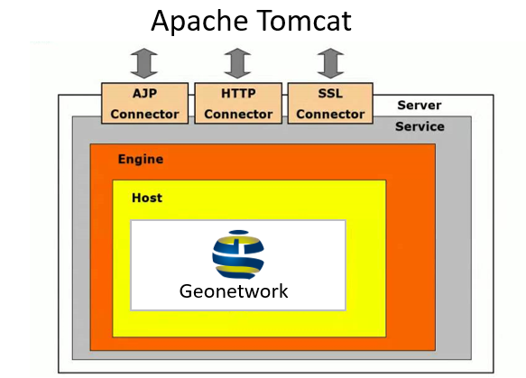
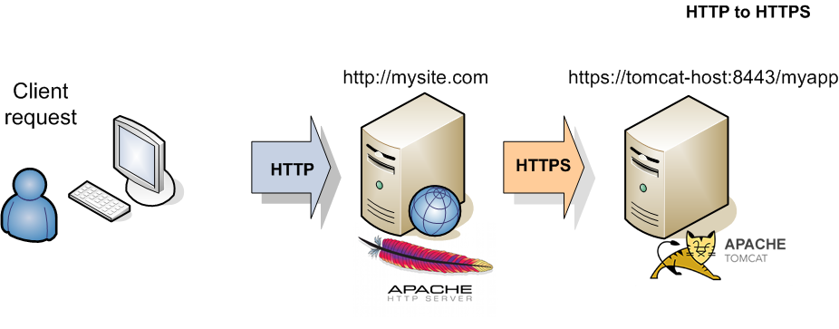
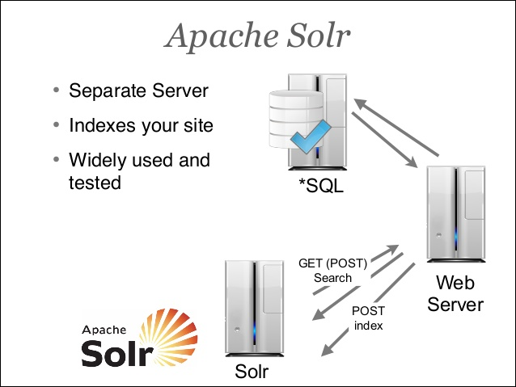
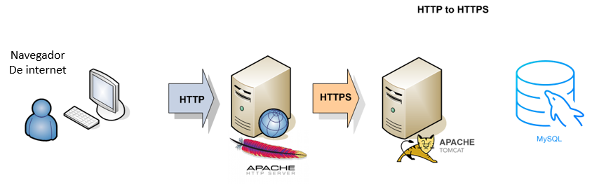

# Apache Tomcat

## Definición 
Funciona como un contenedor de servlets desarrollado bajo el proyecto Jakarta en la Apache Software Foundation. Tomcat implementa las especificaciones de los servlets y de JavaServer Pages (JSP) de Oracle Corporation (aunque creado por Sun Microsystems). 
<div style="text-align:center"></div>

## Rol en geonetwork 
Geonetwork al ser una herramienta de uso libre ya desarrollada en JAVA permite la instalación y configuración en un contenedor de aplicaciones (apache Tomcat) que a su vez está instalado en el servidor, es decir para que Geonetwork funcione es necesario estar desplegado en Tomcat o en una aplicación similar.

## Configuraciones para geonetwork 
Una vez instalado apache Tomcat es necesario configurarlo para que permita ejecutar aplicaciones que solicitan más memoria de la que viene por default, este proceso se realiza a través del archivo ubicado en /etc/default/tomcat7/bin/setenv.sh allí agregar o editar la siguiente línea: JAVA_OPTS = "$JAVA_OPTS -Xms128m -Xmx512m -server" De esta forma se configurarán 512mb para su ejecución siendo esto suficiente para un correcto despliegue, es necesario conocer el usuario administrador que nos permitirá gestionar las instancias de geonetwork en apache tomcat, para realizar este proceso se debe: Ir la carpeta de instalación de apache tomcat vx (siendo x la versión de tomcat puede ser 7, 8 o 9 se recomienda 7 u 8 por temas de compatibilidad), ingresar en la carpeta conf y allí localizar el archivo tomcat-users.xml el cual contendrá los usuario y permisos del mismo

Si es una nueva instalación posiblemente estarán comentados los usuarios, agregar la información indicada a continuación antes de asegurándose que aparezca la siguiente información:

## Cambios de configuraciones antes del despliegue
En caso que se desee modificar la información y configuraciones de la automatización es necesario ingresar a:
branch / allin / ansible / group_vars /  tag_Name_appserver / tomcat
desde aquí se podrán modificar las siguientes opciones
* version actualmente **apache-tomcat-7.0.78**
* ``` java_vm_ms :1024M ``` es posible aumentar la capacitad en caso de ser necesario a ```java_vm_ms :2048M``` 2GB memoria
* ```java_vm_mx: 1024M``` es posible aumentar la capacitad en caso de ser necesario a ```java_vm_mx: 2048M``` 2GB memoria
* ```admin_user: admin``` es posible cualquier nombre de usuario por ejemplo ```admin_user: usu4r104dmn1str4d0r```
* ```admin_password: admin``` es posible cualquier contraseña por ejemplo ```admin_password: c0ntr4s3n4+c0mpl3j4```


## Configuraciones posteriores. 
Normalmente no se deberían cambiar estas configuraciones pero si en algún momento se necesita sería esta última la única opción a cambiar o el usuario o contraseña de tomcat, es posible agregar algunos roles más en caso de ser necesario. 

# Apache Http Server - Servidor Web

## Definición

Es un servidor web HTTP de código abierto, para plataformas Unix (BSD, GNU/Linux, etc.), Microsoft Windows, Macintosh y otras, que implementa el protocolo HTTP/1.12 y la noción de sitio virtual. El servidor Apache es desarrollado y mantenido por una comunidad de usuarios bajo la supervisión de la Apache Software Foundation dentro del proyecto HTTP Server (httpd).

<div style="text-align:center"></div>

## Rol en Geonetwork 
Para poder acceder a Geonetwork es necesario ingresar a una página web a través de un navegador como google Chrome o similar por tal motivo para permitir esta comunicación y esta disponibilidad vía web fue necesario instalar este servidor de aplicaciones web con el fin de agregar las funcionabilidades de ssl, proxis y ftp con el fin de asegurar la seguridad con los módulos activados de apache http. Configuraciones para geonetwork Una vez instalado es necesario activar los módulos de:

* ssl
* headers
* proxy
* proxy_ajp
* proxy_connect
* proxy_ftp
* proxy_html
* proxy_http
* rewrite
* xml2enc
Para llevar a cabo este proceso es necesario retirar el carácter # del archivo conf/httpd.conf

## Cambios de configuraciones antes del despliegue
si se desea inactivar o agregar más módulos de los nombrados en el punto anterior es necesario acceder a:
branch / allin / ansible / roles / webserver / tasks / main.yml
desde la línea 22 a la 29 es posible agregar otros módulos que se podrán consultar desde el siguiente link (https://httpd.apache.org/docs/2.2/es/mod/) lo que permitirá agregar más funcionalidades.

## Configuraciones posteriores 
Normalmente no se deberían modificar estas configuraciones pero si en el algún momento se desea cambiar sus ajustes será necesario volver a ponerle el carácter # para así deshabilitar cada funcionabilidad.

# Solr -Software de indexamiento 

## Definición 

Es un motor de búsqueda de código abierto basado en la biblioteca Java del proyecto Lucene, con APIs en XML/HTTP y JSON, resaltado de resultados, búsqueda por facetas, caché, y una interfaz para su administración. Básicamente se encarga de organizar la toda la información que genera Geonetwork para que sea encontrada de una forma más eficiente que si se buscara a través de la base de datos, este motor tiene en cuenta las búsquedas más frecuentes para disponer de la información más rápido.

<div style="text-align:center"></div>

## Configuraciones para Geonetwork 
Ya viene integrado, no necesita ninguna configuración.

## Cambios de configuraciones antes del despliegue
Para cambiar los ajustes principales ingresar a la ruta:
branch / allin / ansible / group_vars /  tag_Name_solrserver
* ```solr_user: solr```
* ```solr_connect_host: localhost```
* ```solr_port: 8983 ```
* ```solr_xms: 256M ```
* ```solr_xmx: 512M ```
* ```solr_timezone: UTC ``` dependiendo de la zona horaria se puede usar ```solr_timezone: "UTC-5" ``` para Colombia
* ```solr_log_file_path: /var/log/solr.log``` es posible cambiarla por una ruta diferente dependiendo de la necesidad, tener en cuenta que esta es una ruta linux por lo tanto debe respetar estas su sintaxis.

## Configuraciones posteriores.

Ninguna configuración posterior. 
# MySQL - Base de datos

## Definición

Es un sistema de gestión de bases de datos relacional desarrollado bajo licencia dual GPL/Licencia comercial por Oracle Corporation y está considerada como la base datos open source más popular del mundo,1 2 y una de las más populares en general junto a Oracle y Microsoft SQL Server, sobre todo para entornos de desarrollo web.

<div style="text-align:center"></div>

## Configuraciones para Geonetwork

Después de la instalación del motor es necesario crear una base de datos llamada geonetwork con un usuario geonet y una contraseña geonetwork Posterior a esto se configura en los procesos posteriores usando ansible estos datos en geonetwork

## Cambios de configuraciones antes del despliegue
Para cambiar los ajustes principales ingresar a la ruta:
branch / allin / ansible / group_vars /  tag_Name_dbserver
es posible cambiar el nombre de usuario, contraseña,  base de datos, codificación, puerto, timeout de las querys de la siguiente manera:
* ```name: defaultuser ``` se puede cambiar por ejemplo por el ```name: usu4r10g30n3tw0rk```
* ```password: default1``` se puede cambiar por ejemplo por ```password: c0ntr4s3n4g30n3tw0rk```
* ```name: geonetworkdb``` se puede cambiar por cualquier otro nombre ejemplo ```name: dbg30n3tw0rk```
* ```mysql_port: "3306"``` se puede cambiar por cualquier otro por ejemplo ```mysql_port: 3309```
* ```mysql_wait_timeout: "28800"``` este tiempo está representado en milisegundos se puede aumentar o disminuir por ejemplo ```mysql_wait_timeout: 20000```

## Configuraciones posteriores

De ser necesario se cambiaría el nombre de la base de datos, el usuario o la contraseña sin embargo esto puede acarrear perdida de información o segmentación de la misma.

# Ansible
## Definición 
Ansible es una herramienta que permite automatizar todas las tediosas y repetitivas tareas que se pueden generar al administrar un sistema.
## Funcionamiento
Una de las grandes ventajas frente a las competencias es que no es necesario instalar agentes ni servidores. Simplemente instalar ansible en la maquina deseada.
Ansible maneja una machine controler y diferentes nodos. Machine controler se conectara a los nodos por medio de SSH para enviar las instrucciones y configuraciones a ejecutar en los nodos deseados.

## Rol en geonetwork
Geonetwork esta siendo despleglado dentro de una maquina virtual y la manera en la cual se esta llegando a ella es por medio de ansible creando task programadas en __YAML__ haciendo uso de los modulos necesarios.
## Configuraciones
Para realizar las correctas configuraciones es necesario leer la documentacion de __vagrant__, ya que se esta realizando un aprovisionamiento __Vagrant Ansible__. Las configuraciones mas directas con Ansible son realizadas en el archivo llamado ansible.cfg.
### Ansible.cfg
Este archivo guarda la configuración general de ansible. Las configuraciones aplicadas para este caso son descritas a continuación.
En este caso se deshabilita totalmente la verificación del host SSH clave.
```javascript
[defaults]
host_key_checking = no
```
El anterior paramentro indica la comprobación de clave host, la cual se encuentra activa en Ansible 1.3 y posteriores, por tal razon se desactiva.
```javascript
[ssh_connection]
ssh_args = -o ControlPersist=60s -o UserKnownHostsFile=/dev/null -o IdentitiesOnly=yes
```
Los ajustes anteriores son especificamente para conexiones SSH, al establecer __**ssh_args**__ pasara a un conjunto especifico de opciones que se le estan dando a continuacion como se observa __ControlPersist=60s..__ de modo que no tomara los valores predeterminados.
```javascript
ControlPersist=60s
```
ControlPersist nos permite definir el tiempo durante el cual se mantendrá viva la conexión original una vez se haya cerrado (en caso que queden tareas pendientes en alguna de las sesiones secundarias).
### Inventario
Ansible trabaja con un inventario, este inventario es un archivo en el cual se agrupan y enlistan los nodos segun mas convenga.
A continuación se dara un breve explicación del por que se encuentran los parametros actualmente.
```
manager ansible_connection=local
```
Ansible no se limita a un tipo de conexion, con este parametro especifico de host el tipo de conexion se puede cambiar. En este caso se utiliza local ya que es necesario desplegar el libro de jugadas a la machine control de si mismo.
```javascript
appserver ansible_user=vagrant ansible_host=10.0.0.21 ansible_ssh_private_key_file=/keys/private_key_appserver
```
De la manera mostrada anteriormente se agrega un host al inventario y es posible ejecutar las tareas ya programadas sobre ese host.
Este ejemplo contiene una serie de parametros, los cuales seran descritos a continuación:
* ansible_user: El nombre de usuario para poder operarlo.
* ansible_host: El nombre del nodo con el cual sera identificado.
* ansible_ssh_private_key_file: Este archivo es la llave con la cual es se conectara por SSH manejado.

Los anteriores parametros indican con que nombre, host y clave se conectara al servidor.
```
[tag_Name_appserver]
appserver
```
Los servidores o nodos pueden ser agrupados por caracteristicas que sean consideradas importantes para manejar un mayor orden y no tener la necesidad de llamar a cada uno.
## Vagrant
### Definicion
Vagrant es una herramienta para la creación y configuración de entornos de desarrollo virtualizados. Brinda la capacidad de instalar y configurar software en una máquina virtual para simular que nos encontramos en el servidor en el que se alojará la aplicación web.
### Rol en geonetwork
Gracias a las capacidades de vagrant, se esta haciendo un aprovisionamiento ``` Vagrant-Ansible``` 
de modo que con vagrant y virtualbox se esta creando un entorno de desarrollo haciendo uso de una de sus box llamada ``` ubuntu/trusty64```  en la cual se esta aprovisionando ansible y desde la cual se realiza el despliegue a los servidores.

Del mismo modo se crean tres más con la diferencia que estan no utilizan la box ``` ubuntu/trusry64```  ni tampoco aprovisionan a Ansible. Estas máquinas manejan la caja ``` centos/7```  y aca una de ellas es agregada un ip con la cual seran identificadas.
* appserver
* solrserver
* webserver

Ejemplo creacion y configuracion de appserver.
```javascript
config.vm.define "appserver" do |appserver|
		appserver.vm.provider :virtualbox do |vb|
			vb.memory = 1024
	    vb.cpus = 2
		end
    appserver.vm.network "private_network", ip: "10.0.0.21"
  end
```
### Configuracion despues de instalarlo
Una vez instalado *Vagrant* junto con *Virtualbox* (si no se tiene instalado ya), es necesario crear una carpeta y seguidamente desde CMD y dentro de la carpeta ejecutar el comando ```vagrant init```, este comando crear una carpeta llamada *.vagrant* la cual contendra las llaves SSH una vez se cree una machine y un archivo de configuracion llamado *Vagrantfile* en el cual debe ir las configuraciones correspondientes que se encuentran en la siguiente [ruta](https://github.com/FelipeMora/cocrea-geonetwork/blob/docs/vagrant/Vagrantfile).
Para que las configuraciones del archivo Vagrantfile se ejecuten es necesario ejecutar ```vagrant up```  el cual creara los entornos de desarrollo planteados en el archivo.
### Cambios que se pueden hacer antes de desplegar geonetwork
Modificar las configuraciones de vagrant en ocasiones pueden implicar llegar a mas de un archivo.
#### Memoria y cpu asignada 
Cambiar la memoria asignada a un servidor se realiza desde el archivo ```Vagrantfile```, especificamente en esta linea.
```javascript
vb.memory = 1024
```
La memoria asignada a cada servidor es de 1024 megabytes que equivale a 1,024 gigabytes siendo esto considerado lo necesario, pero en caso de querer requerer mas por diferentes motivos y la maquina dispone de tal capacidad es posible hacerlo.
### Configuración de red de los servidores
Las configuraciones de la tarjeta de red en modo _Red interna_ de ```VirtualBox``` se estan realizando de la siguiente manera.
```
appserver.vm.network "private_network", ip: "10.0.0.21"
``` 
En donde se esta indicando donde se va a poner la ip que va a tener la maquina.
## VirtualBox
### Definicion
VirtualBox es una herramienta de virtualización de codigo abierto multiplataforma, que permite crear unidades de disco virtuales en donde se puede instalar un sistema operativo invitado dentro del que se utiliza normalmente en el equipo.
### Rol en geonetwork
VirtualBox es el proveedor que se esta manejando para Vagrant, de tal forma que los servidores que se encuentran en el archivo ```Vagrantfile``` virtualbox es el encargado de crearlos.
